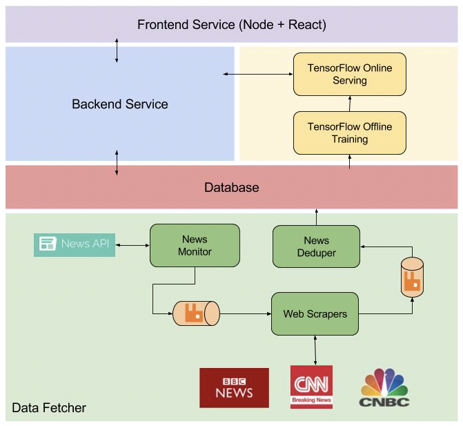

# Tap News
## Overview
This is a real-time news scraping and recommendation system. I built a news pipeline to scraping real-time latest news from a bunch of news source such as CNN, BBC, ESPN and TechCrunch. Created a single-page web application to show the news to users, and recommend news to users based on users' click behavior on different news topics. 
## Architecture

### News Pipeline
News pipeline is composed by news monitor, web scraper and news deduper, news is sent and received between them by RabbitMQ which decouples these components. The news monitor use [News API](https://newsapi.org) to derive latest news and store news title MD5 digest into Redis to avoid sending same news to the message queue. The web scraper use a third party package [Newspaper](https://newspaper.readthedocs.io/en/latest/) to fetch corresponding news articles from offical news website. News depuper implements TF-IDF to calculate similarity of news to avoid storing same news from different news source into MongoDB. For similar news, only store the one published firstly.

### News Topic Modeling
The news topic classification is implemented by Convolutional Neutral Nework(CNN) in TensorFlow and deployed online using the offline trained model. Manually label the news with 17 classes: `Colleges & Schools`, `Environmental`, `World`, `Entertainment`, `Media`, `Politics & Government`, `Regional News`, `Religion`, `Sports`, `Technology`, `Traffic`, `Weather`, `Economic & Corp`, `Advertisements`, `Crime`, `Magazine`, `Other`.

### News Recommendation
I built a click log processor to implement a time decay model. If a news topic is clicked, p = (1-α)p + α, if not, p = (1-α)p, Where p is the selection probability, and α is the degree of weight decrease. The result of this is that the nth most recent selection will have a weight of (1-α)^n. Using a coefficient value of 0.05 as an example, the 10th most recent selection would only have half the weight of the most recent. Increasing α would bias towards more recent results more.

When some news' topic with the most probability for that user, the webpage will show a "Recommend" tag to the user.
